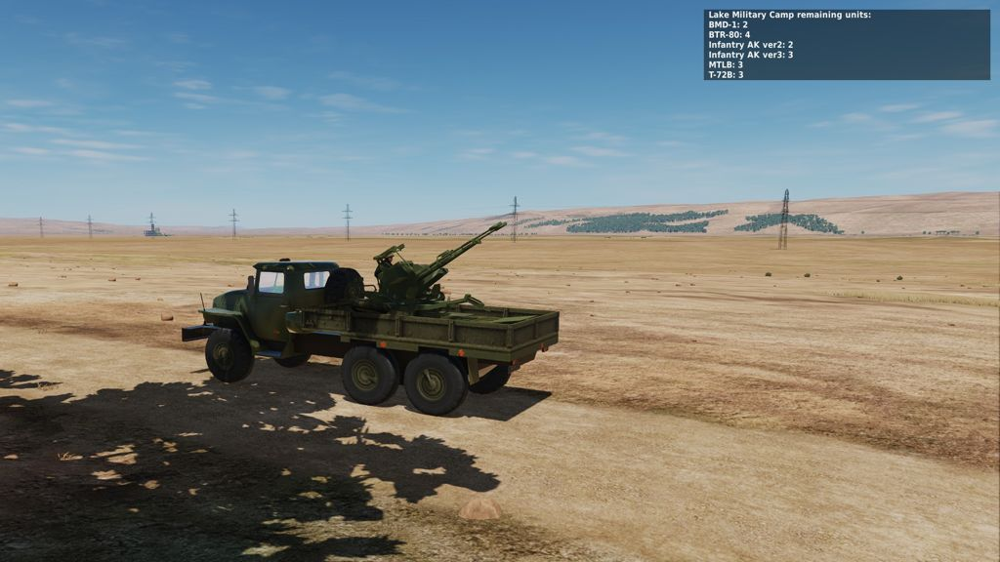

# Nati DCS Tools

**IMPORTANT**
All of my script depends on MIST scripting tools.


Before using these tools make sure that you have an updated version of [MIST](https://github.com/mrSkortch/MissionScriptingTools) loaded into your mission, before loading any of these scripts.  
Loading [MIST](https://github.com/mrSkortch/MissionScriptingTools) into **INITIALIZATION SCRIPT** part (triggers page) is preferable.

## Zones Units Type Counters

### How to use
1. Create one or more zones with the Property `COUNT_UNIT_TYPES`.
1. Save the file: [natidcs-zones-count-units.lua](https://raw.githubusercontent.com/nati-mask/natidcs/main/natidcs-zones-count-units.lua) and load it as a `ONCE MISSION START`, `DO SCRIPT FILE` trigger.
1. That's it! The script will count units by types on each zone, and add F10 menu to query the counts.
1. Optional - If you want to not report counts on unit dead event, please remove the last(?) line of the script, the one which says
    ```lua
    mist.addEventHandler(...
    ```

---
Thank you :)

Nati Mask

